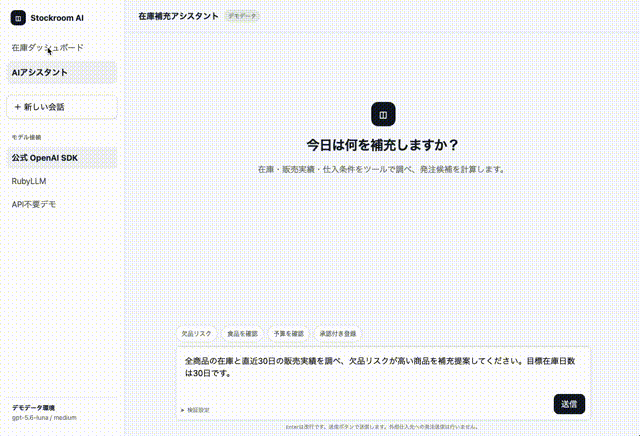

# ruby-agent-stream

[English](README.md) | 日本語

Ruby の AI SDK が返す event を、[AI SDK UI Message Stream Protocol v1](https://ai-sdk.dev/docs/ai-sdk-ui/stream-protocol) の SSE に変換するための小さなライブラリです。

中心にあるのは provider 非依存の `AgentStream::UIMessage::V1::Event` と `AgentStream::UIMessage::V1::Stream` です。OpenAI、Anthropic、RubyLLM は独立した adapter であり、Stream 自体は各 SDK の class を知りません。

```text
OpenAI / Anthropic / RubyLLM の event
                ↓
       provider adapter
                ↓ Enumerable<Event>
        ui_stream << event
                ↓
 UI Message Stream Protocol v1 SSE
```

## demo rails ai agent saas app gif




## 設計

書き込み interface は `ui_stream << event` だけです。

役割は次のように分離しています。

- `Event`: event type、必須／任意 field、JSON 互換性を生成時に検証する
- `Stream`: message、step、part、tool の順序を検証し、SSE frame にする
- `Adapters::*`: SDK event の解釈、tool input JSON の蓄積、provider metadata の変換を行う

この境界により、新しい provider は gem 本体を変更せず `Enumerable<AgentStream::UIMessage::V1::Event>` を実装すれば追加できます。

## Installation

公開前の checkout を使う場合:

```ruby
gem "ruby-agent-stream", git: "git@github.com:shuent/ruby-agent-stream.git"
```

使う provider SDK だけを application 側に追加します。この gem はすべての SDK を runtime dependency にはしません。

```ruby
gem "openai", "~> 0.85"       # OpenAI adapter を使う場合
gem "anthropic", "~> 1.68"   # Anthropic adapter を使う場合
gem "ruby_llm", "~> 1.16"    # RubyLLM adapter を使う場合
```

Ruby 3.3 以上が必要です。

## 基本 API

provider を使わず、protocol event を直接送る最小例です。

```ruby
require "ai_stream"

Event = AgentStream::UIMessage::V1::Event
ui_stream = AgentStream::UIMessage::V1::Stream.new

ui_stream << Event.new(:start, message_id: "assistant-1")
ui_stream << Event.new(:start_step)
ui_stream << Event.new(:text_start, id: "text-1")
ui_stream << Event.new(:text_delta, id: "text-1", delta: "Hello")
ui_stream << Event.new(:text_end, id: "text-1")
ui_stream << Event.new(:finish_step)
ui_stream << Event.new(:finish, finish_reason: :stop)

ui_stream.each { |frame| puts frame }
```

`Stream.new(response.stream)` のように `#write(String)` を持つ sink を渡すと、frame は即時に書き込まれます。sink を省略すると `frames` に保持され、Rack body や test に使えます。terminal event (`finish`、`abort`、`error`) の直後には `data: [DONE]` が自動で追加されます。

不正な field や JSON 値は `Event::SchemaError` / `Event::JSONCompatibilityError`、不正な event 順序は `Stream::ProtocolError` になります。RBS も同じ public event surface を overload で定義しています。

### 別 HTTP request で承認を継続する

`tool-input-available` と `tool-approval-request` の後にstepとHTTP streamを終了します。
AI SDKの `addToolApprovalResponse` は既存tool partを更新し、
`sendAutomaticallyWhen: lastAssistantMessageIsCompleteWithApprovalResponses` を設定すると
判断が新しいHTTP requestとして送信されます。server保存の `Event` 履歴から検証状態だけを復元できます。
過去のSSE frameは再送しません。

```ruby
ui_stream = AgentStream::UIMessage::V1::Stream.new(response.stream, continuation: saved_events)
ui_stream << Event.new(:start, message_id: original_assistant_id)
ui_stream << Event.new(:start_step)
ui_stream << Event.new(:tool_approval_response, approval_id: approval_id, approved: true)
ui_stream << Event.new(:tool_output_available, tool_call_id: original_tool_call_id, output: result)
ui_stream << Event.new(:finish_step)
ui_stream << Event.new(:finish)
```

拒否時は `approved: false` と `tool_output_denied` を送ります。`continuation:` は同じassistant
messageの1つ以上のHTTP区間を構成する `Event` 列を受け取り、各区間は `finish` で終了している必要があります。
途中・abort・errorの履歴は拒否します。元のassistant IDと信頼できるserver履歴を渡すのはcallerの責務です。
復元するのはprotocol検証状態だけです。承認の永続化、本人・確定引数との対応付け、認可、陳腐化判定、
一度だけのtool実行はアプリ側で担い、event履歴のreplayからtoolを実行しないでください。

## OpenAI

official [`openai-ruby`](https://github.com/openai/openai-ruby) の Responses stream をそのまま adapter に渡します。

```ruby
require "openai"
require "ai_stream/adapters/openai"

client = OpenAI::Client.new
sdk_stream = client.responses.stream(
  model: ENV.fetch("OPENAI_MODEL"),
  input: "Write one short greeting."
)

ui_stream = AgentStream::UIMessage::V1::Stream.new($stdout)
AgentStream::Adapters::OpenAI.new(sdk_stream).each do |event|
  ui_stream << event
end
```

Responses API の text、refusal、reasoning、function call input、usage、完了／失敗 event を変換します。SDK が追加した未知の `response.*` event は forward compatibility のため無視し、provider と無関係な値は `UnsupportedEventError` にします。

アプリが複数stepのtool loopを所有する場合は `lifecycle: :content` を使います。このモードではadapterはprovider contentと `message-metadata` だけを出し、message/step境界はアプリが出します。列挙後は `response` から完了したSDK responseを取得でき、`finish_reason` は `:tool_calls`、`:stop`、または変換済みのincomplete理由です。

```ruby
ui_stream << AgentStream::UIMessage::V1::Event.new(:start, message_id: message_id)

loop do
  ui_stream << AgentStream::UIMessage::V1::Event.new(:start_step)
  adapter = AgentStream::Adapters::OpenAI.new(sdk_stream, lifecycle: :content)
  adapter.each { |event| ui_stream << event }

  # アプリで全toolを実行し、ここでtool outputを出す。
  # 次のResponses streamにはprevious_response_idと
  # function_call_output input itemを渡す。
  ui_stream << AgentStream::UIMessage::V1::Event.new(:finish_step)
  break unless adapter.finish_reason == :tool_calls
end

ui_stream << AgentStream::UIMessage::V1::Event.new(:finish, finish_reason: adapter.finish_reason)
```

`lifecycle: :step` はmessage全体の `start` / `finish` だけを省き、既定の `:message` は従来どおり1 response分の完全なenvelopeを出します。`:content` のtool outputはアプリの `finish-step` より前に出してください。Responses APIで `previous_response_id` を使っても前回のinstructionsは引き継がれないため、provider呼び出しごとに再送します。

## Anthropic

official [`anthropic-sdk-ruby`](https://github.com/anthropics/anthropic-sdk-ruby) の `MessageStream` は raw event と high-level helper event の両方を yield します。adapter は raw event を変換し、同じ内容の helper event は重複出力しません。

```ruby
require "anthropic"
require "ai_stream/adapters/anthropic"

client = Anthropic::Client.new
sdk_stream = client.messages.stream(
  model: ENV.fetch("ANTHROPIC_MODEL"),
  max_tokens: 512,
  messages: [{ role: :user, content: "Write one short greeting." }]
)

ui_stream = AgentStream::UIMessage::V1::Stream.new($stdout)
AgentStream::Adapters::Anthropic.new(sdk_stream).each do |event|
  ui_stream << event
end
```

text、thinking/signature、tool use input、usage、stop reason を変換します。client tool は通常の tool event、server/MCP tool use は `providerExecuted: true` になります。

## RubyLLM

RubyLLM は callback で chunk を返すため、`Enumerator` で SDK event stream にします。

```ruby
require "ruby_llm"
require "ai_stream/adapters/ruby_llm"

sdk_events = Enumerator.new do |events|
  RubyLLM.chat.ask("Write one short greeting.") do |chunk|
    events << chunk
  end
end

ui_stream = AgentStream::UIMessage::V1::Stream.new($stdout)
AgentStream::Adapters::RubyLLM.new(sdk_events).each do |event|
  ui_stream << event
end
```

chunk の text、thinking、URL attachment、streamed/structured tool call と、tool-result `RubyLLM::Message` を扱います。agent loop の tool result も含める場合は `after_message` callback で `message.tool_result?` の message を同じ Enumerator に追加してください。1件以上のtool-result message後の最初のchunkで新しいUI stepを始め、RubyLLMがprovider呼び出しごとにstream keyを再利用できるようにします。usageは自動tool loop内の各provider呼び出し分を合算します。

## Rails (`ActionController::Live`)

controller が HTTP transport、Stream が SSE、adapter が provider 変換を担当します。

```ruby
class ChatsController < ApplicationController
  include ActionController::Live

  def create
    ui_stream = AgentStream::UIMessage::V1::Stream.new(response.stream)
    ui_stream.headers.each { |name, value| response.headers[name] = value }

    model.stream_events(params.require(:prompt)).each do |provider_event|
      ui_stream << AgentStream::UIMessage::V1::Event.new(provider_event.type, **provider_event.payload)
    end
  rescue ActionController::Live::ClientDisconnected, IOError
    Rails.logger.info("UI message client disconnected")
  ensure
    response.stream.close
  end

end
```

headers は最初の event より前に設定し、response stream は必ず close してください。

## 独自 adapter

独自 adapter は provider event を受け取り、検証済み Event を yield するだけです。利用者側で同じ interface の adapter を gem 外に置けます。

```ruby
class MyProviderAdapter
  include Enumerable

  def initialize(events)
    @events = events
  end

  def each
    return enum_for(:each) unless block_given?

    yield AgentStream::UIMessage::V1::Event.new(:start)
    yield AgentStream::UIMessage::V1::Event.new(:start_step)
    # @events を Event に変換して yield
    yield AgentStream::UIMessage::V1::Event.new(:finish_step)
    yield AgentStream::UIMessage::V1::Event.new(:finish, finish_reason: :stop)
    self
  end
end
```

adapter の出力も `ui_stream << event` を通るため、Event の schema と Stream の順序検証を迂回できません。

## Examples

- `examples/openai.rb`: official OpenAI Responses stream
- `examples/anthropic.rb`: official Anthropic Messages stream
- `examples/ruby_llm.rb`: RubyLLM callback を Enumerator に接続
- `examples/rails_demo`: plain model event → `Event` → Rails SSE の流れをControllerに示すdemo
- `examples/react_client`: `@ai-sdk/react` の `useChat` で Rails demo を消費

Rails と React の end-to-end demo:

```bash
# リポジトリルートから
bin/dev
```

http://127.0.0.1:5173/ を開きます。DB準備とRails・Viteの起動をまとめて行い、Ctrl-Cで両方停止します。`examples/rails_demo` 内の `bin/dev` からも起動できます。API設定と検証方法は[サンプルのREADME](examples/rails_demo/README.md)を参照してください。

## Tests

```bash
bundle exec rake test
bundle exec rbs validate
bundle exec rubocop
gem build ruby-agent-stream.gemspec
```

adapter fixture は単なる test double ではありません。保存した実形式 JSON を official OpenAI / Anthropic SDK の model converter で復元し、RubyLLM は実 class (`Chunk`、`Message`、`ToolCall`、`Thinking`) を構築してから変換しています。最後に全 adapter 出力を本物の `UIMessage::V1::Stream` に投入して検証します。

## Scope

この gem は model 選択、conversation 保存、tool 実行、approval policy、retry、Rails の thread 管理を行いません。provider event を共通 Event に変換し、その Event を UI Message Stream Protocol v1 として安全に出力するところまでが責務です。

## License

MIT. See [`LICENSE.txt`](LICENSE.txt).
