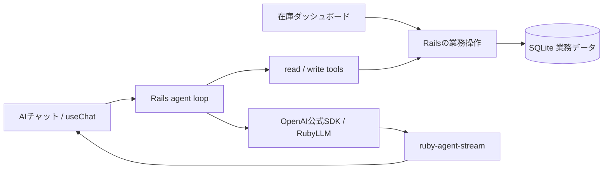

Railsで本格的なAI agentを作ってみる。

前回は、RubyのLLM SDKが返すイベントをVercel AI SDKのUI Message Streamへ変換する [`ruby-agent-stream`](https://github.com/shuent/ruby-agent-stream) を紹介しました。[前回の記事](https://zenn.dev/shuent/articles/e0c159cd2989f9)で扱ったのは、Railsにagentと業務処理を置き、Reactの`useChat`へテキスト・reasoning・tool callを運ぶための境界設計です。

今回はその境界を実際のアプリで使います。題材は、小さな在庫管理SaaSです。まず在庫や販売実績を確認する普通のダッシュボードがあり、そのSaaSの機能を自然言語からも使えるようにします。AIに調査してもらい、続けて補充発注の登録を頼み、人間が承認すると業務DBに保存される、というところまでを扱います。

この記事の商品・在庫・販売実績・仕入条件は、すべてseedで用意したデモデータです。「発注登録」はアプリ内の補充発注レコードの作成を指し、外部の仕入先へ注文を送信するものではありません。認証や課金など、SaaS製品全体の実装は今回の範囲に含めていません。

この記事で取得済みなのは、実装、APIを使わない回帰テスト、非課金fixtureによる実ブラウザの承認・DB反映です。**両SDKの実APIによる調査・追質問と、指定モデルのreasoning出力は未検証です。** 以下では、実装した流れと確認できた結果を区別します。

## 画面からも、AIからも同じ在庫を使う

使う流れは次のようになります。

1. ダッシュボードで在庫、販売実績、仕入条件、登録済み補充発注を見る
2. AIに「欠品リスクが高い商品を調べて」と依頼する
3. 在庫・販売・仕入条件のtool結果と補充案を受け取る
4. 続けて「先ほどのSKUを○点で登録して」と依頼する
5. 提案されたSKUと数量を確認して承認する
6. ダッシュボードで補充発注レコードを確認する


*実アプリのスクリーンショット4枚を各2.2秒で並べたGIFです。承認提案はモデル生成ではなく、非課金fixtureとして保存したものです。承認ボタンから先は実際のローカルHTTPとSQLiteを使い、`TEA-GRN` 60点・45,600円の登録を確認しています。*

ここで大事なのは、チャット用に別の在庫を作らないことです。ダッシュボードとAIのread toolは同じSQLiteの業務データを参照します。補充数の計算や発注登録もRailsの業務操作にまとめ、controllerとtoolで同じルールを二重に実装しない構成にします。



React側の公開入力・出力・操作契約は`examples/react_client/src/domain.ts`、Railsの在庫参照と補充計算は`InventoryCatalog`に置いています。LLMは公開された操作を選び、Railsがデータを取得・検証・計算する役割です。

## 数値の根拠をread toolにする

今回のread toolは四つです。

| tool | 取得・計算するもの |
| --- | --- |
| `search_inventory` | 在庫、引当済み数量、利用可能在庫、発注点 |
| `review_sales` | 販売数、1日あたりの販売ペース、在庫日数 |
| `check_supplier_terms` | 納期、最小発注数、入数、仕入単価 |
| `calculate_replenishment` | 目標在庫日数と仕入条件から求める補充案 |

たとえば補充数は、LLMに暗算させずRubyで計算します。以下は`InventoryCatalog#calculate_replenishment`の計算部分の抜粋です。レコード取得と戻り値の組み立てを省略しています。

```ruby
target_stock = (metric.units_sold.fdiv(metric.period_days) * target_cover_days).ceil
shortage = [target_stock - item.available_stock, 0].max
requested = [shortage, term.min_order_quantity].max
quantity = shortage.zero? ? 0 : (requested.fdiv(term.pack_size).ceil * term.pack_size)
```

30日間の販売実績から目標在庫を求め、利用可能在庫を差し引き、最小発注数と入数に合わせます。この式は今回のデモのルールです。需要予測や季節性までモデル化したものではありません。

LLMには、どの商品を調べるか、追加でどの情報が必要か、結果をどう説明するかを任せます。数値と業務上の制約はtool結果として返すため、UIでも回答の根拠を追えます。

## write toolは承認を挟む

`create_replenishment_order`は、SKUと数量を指定して補充発注を登録する操作です。read toolと違い、モデルが呼び出した時点で業務DBを変更してはいけません。

今回使うのは[AI SDKの標準tool approval](https://ai-sdk.dev/docs/ai-sdk-ui/chatbot-tool-usage)です。tool inputを受信したあと、`approval-requested`のpartを承認カードとして描画し、ユーザーの判断を`addToolApprovalResponse`へ渡します。承認カードそのものはアプリに実装します。Railsが承認イベントを送れば`useChat`が業務に合ったボタンを自動で作ってくれる、という仕組みではありません。

`App.tsx`の`useChat`設定です。importと周辺のstate宣言を省略しています。

```tsx
const { messages, status, error, sendMessage, regenerate, stop, clearError, addToolApprovalResponse } = useChat({
  id: conversation.id, transport, messages: conversation.messages,
  sendAutomaticallyWhen: lastAssistantMessageIsCompleteWithApprovalResponses,
  onFinish: onChanged,
  onData: (part) => { if (part.type === "data-run") setRunData((part as any).data as RunData); },
});
```

`ToolCard`の承認ボタンからは、次の判断を渡します。カードの説明文と拒否ボタンは省略しています。

```tsx
<button data-testid="approve" disabled={busy} onClick={() => onApproval?.({ id: record.approval.id, approved: true })}>承認して登録</button>
```

親コンポーネントは`onApproval`を`addToolApprovalResponse`へ接続しています。標準helperが最後のstepの承認応答を確認し、次のHTTP requestを送ります。

UIの承認状態と、実際に書き込んでよいかという判断は分けて考えます。

| 担当 | 持つもの |
| --- | --- |
| `useChat` | assistant messageのtool part、承認待ち・回答済み・結果の状態、承認応答の送信 |
| Rails | 会話とtool callに結び付く承認ID、確定した引数、人間の判断、実行済み状態、業務DBへの書き込み |

流れは「承認要求をstreamへ出して終了 → 別HTTP requestで承認・拒否を受け取る → 同じassistant messageとtool callを続行」です。承認IDに対応するSKUと数量はサーバー側に保存し、クライアントが送り直した引数をそのまま実行しません。

`AgentApproval`に会話、assistant ID、tool call ID、tool名、引数、データrevisionを保存しています。`decide!`はこれらの一致と真偽値の判断を検証し、ロックの中で次の分岐に進みます。以下は検証後の実コードで、周辺の`with_lock`と戻り値を省略しています。

```ruby
return outcome if status != "pending"

if data_revision != InventoryCatalog.new.revision
  update!(status: "stale", outcome: { error: "データが更新されました。新しい会話で再提案してください。" })
elsif !approved
  update!(status: "denied", outcome: { denied: true })
else
  result = InventoryCatalog.new.register_order!(input: input, approval: self)
  update!(status: "executed", outcome: { order: result, demo_data: true })
end
```

`register_order!`はSKU、整数の数量、最小発注数、入数、上限10,000点を検証します。補充発注側にも承認IDのunique indexを置き、一つの承認から作るレコードを一つに制限します。

承認応答の処理は両SDK経路で共通です。`AgentChat#approval_events`が登録または拒否の結果を返し、**この承認直後の応答ではLLMを再呼び出ししません**。Railsの定型メッセージとtool outputを同じassistant messageへ追加します。モデルに登録結果をさらに解釈させるloopまで再開する実装とは区別しています。

拒否では補充発注を作りません。承認後も同じ応答が二度届いたからといって二重登録せず、保存済みの結果へ結び付けます。会話履歴・承認待ち・実行ログを保存することと、承認対象の業務writeは別です。「承認前は書き込まない」は、前者の保存まで禁止するという意味ではありません。

## 次の依頼にも会話を引き継ぐ

「先ほどのSKUを○点で登録して」という依頼には、前の回答とtool結果が必要です。ブラウザで過去の吹き出しが見えるだけでは、次のLLM呼び出しにその文脈が入ったことにはなりません。

会話IDとサーバー側に保存した履歴を対応させ、続きの依頼では先行メッセージと関連するtool結果をLLMへ渡すようにします。新しい会話や別のセッションとは分離します。承認を待つ間にHTTP接続が閉じても、会話と確定した操作を保存していれば続行できます。

保存先はSQLiteの`AgentConversation`です。リロード時は保存したUI messageを`useChat`の初期`messages`へ渡します。サーバーは会話IDと`X-Demo-Session`のトークンのdigestを照合して会話を取り出します。これはローカルデモのセッション分離で、ユーザーアカウントやテナントの認可を実装したものではありません。

次のモデル入力には、保存したテキストに加えてtoolの`type`、`input`、`output`、`state`をJSON文字列にしたものを渡します。`AgentChat#prior_messages`の中心部分です。前後のメソッド定義を省略しています。

```ruby
messages[0...-1].filter_map do |message|
  text = AgentCacheKey.message_text(message)
  results = Array(message["parts"]).filter_map do |part|
    JSON.generate(part.slice("type", "input", "output", "state")) if part["type"].start_with?("tool-")
  end
  content = ([text] + results).reject(&:empty?).join("\n")
  { role: message.fetch("role"), content: content } unless content.empty?
end
```

SDK固有のconversation objectをHTTP間で保持するのではなく、サーバーに残した業務上の文脈を再構成する方式です。OpenAIの`previous_response_id`は、一つの依頼の中のread tool loopで使います。

## 二つのRuby SDKから同じUIへ

Reactは一つの`useChat`を使い、送信先を切り替えます。

| endpoint | 役割 |
| --- | --- |
| `POST /chat/openai` | OpenAI公式Ruby SDKで実モデルを呼ぶ |
| `POST /chat/ruby_llm` | RubyLLMで実モデルを呼ぶ |
| `POST /chat/no-llm-call` | APIを呼ばず`DemoModel`の固定イベントを流す |

実APIの二経路はモデルを`gpt-5.6-luna`、reasoning effortを`medium`に揃えます。異なるproviderの性能比較ではなく、同じRailsの業務操作へ二つのSDKからつなぐための実装です。

function callingでは、モデルが返した呼び出しをアプリが実行し、その結果をモデルへ戻して次の回答につなげます。[OpenAIのFunction callingガイド](https://developers.openai.com/api/docs/guides/function-calling)にも、この往復が説明されています。

### OpenAI公式SDK

`OpenaiAgentRunner#each`から、SDKを呼んでcontentを流す部分を抜粋します。外側のstep loopとtool定義を省略しています。

```ruby
sdk_stream = @client.responses.stream(
  model: AgentChat::MODEL, input: input, instructions: AgentChat::SYSTEM_PROMPT,
  tools: tool_definitions, tool_choice: index.zero? ? :required : :auto,
  parallel_tool_calls: true, reasoning: { effort: AgentChat::REASONING.to_sym, summary: :auto },
  previous_response_id: previous_response_id
)
adapter = AgentStream::Adapters::OpenAI.new(sdk_stream, lifecycle: :content)
adapter.each { |provider_event| yield provider_event }
calls = function_calls(adapter.response)
```

read toolは結果を`function_call_output`として次のResponses requestへ返します。write toolの場合は次の分岐で承認を要求し、toolを実行せずに待機します。周囲の`filter_map`とread tool処理は省略しています。

```ruby
if call.name.to_s == "create_replenishment_order"
  yield @agent.request_approval(call_id: call.call_id, name: call.name.to_s, input: JSON.parse(call.arguments))
  waiting = true
  next
end
```

OpenAI側はResponses APIの呼び出し、tool output、次の呼び出しというloopをアプリが明示的に持ちます。`ruby-agent-stream`のOpenAI adapterは`lifecycle: :content`で使い、messageとstepの開始・終了をRails側で制御します。最初のtool callが返っただけでUI message全体を閉じないためです。

### RubyLLM

`RubyLlmAgentRunner#each`は、Responses protocolを指定してSDKの会話を構築します。以下は設定部分の抜粋です。

```ruby
chat = RubyLLM.chat(model: AgentChat::MODEL, provider: :openai, protocol: :responses,
                    assume_model_exists: true)
              .with_instructions(AgentChat::SYSTEM_PROMPT)
              .with_tools(*@agent.tools)
              .with_tool_options(choice: :auto, calls: :many, concurrency: false)
              .with_thinking(effort: AgentChat::REASONING.to_sym, display: :summarized)
@agent.prior_messages.each { |message| chat.add_message(message) }
```

`CreateReplenishmentOrderTool`は`requires_approval`を宣言しています。`chat.ask`から得るchunkと`after_message`のtool resultをadapterへ流し、SDKが承認待ちになったときは次のようにRailsの永続承認へ接続します。adapterの列挙loopのほかの部分は省略しています。

```ruby
if event.type == :finish_step && chat.awaiting_approval?
  chat.pending_approvals.each do |call|
    yield @agent.request_approval(call_id: call.id, name: call.name, input: call.arguments)
  end
end
```

RubyLLM側はSDKが持つ会話・tool loopのAPIを使います。同じtoolを公開していても、SDKへの入力とtool結果の戻し方、承認待ちで中断して再開する方法はOpenAI公式SDKと異なります。この差をrunnerの内側へ置き、Reactへ渡すUI Message Streamを揃えます。

今回のRubyLLM経路は、Responses APIに対応する2.0開発版（commit `9b30f939fe96b461e62ac62314350cf5c54f1394`）を使用しています。途中で使っていた1.16.0では、対象モデルでtoolsとreasoningを組み合わせる経路が阻害されました。これはSDKがどのAPI endpointへ送るかという制約で、UI Message Streamへの変換不具合とは別です。版を固定した実装と、取得済みの実行結果を後述します。

### multi-stepで必要になったlibの修正

OpenAI adapterには、アプリが複数のResponses streamを一つのUI messageへ組み込めるよう、`lifecycle: :content`と列挙後の`response`、`finish_reason`を追加しました。

RubyLLM adapterでは、次のprovider completionがtoolのstream keyを再利用した際、前のtoolと衝突する問題がありました。tool result後の次chunkを新しいUI stepとして扱い、stepの切り替わりでkeyとpart IDをリセットします。usageも各completionの最終snapshotを合算するようにしました。

さらに承認では、別HTTP requestで作った`Stream`が前のtool callを知らない、という不足がありました。`Stream.new(sink, continuation: prior_events)`でサーバーに保存したEvent履歴から検証状態を復元する契約を追加しています。過去のSSEを再送する引数ではありません。同じassistant IDで開始し、保存済みのtool callへ承認応答と結果をつなぎます。

この契約は、installed AI SDKの`Chat`と`DefaultChatTransport`へRubyのSSEを渡す、API呼び出しなしの確認でも使っています。承認・拒否のどちらも別HTTP requestに進み、assistant一つ・tool一つのまま続行することをプロトコルの回帰テストで確認しています。業務DBへの書き込みを確かめた実API検証とは区別します。

ライブラリに追加したのはイベントを正しく運ぶための契約です。業務データ、発注承認の永続化、cache、tool実行は引き続きRailsアプリが持ちます。

## tool結果をそのまま業務カードへ

[AI SDKのGenerative UI](https://ai-sdk.dev/docs/ai-sdk-ui/generative-user-interfaces)では、toolが返した構造化データをReactコンポーネントへ対応付けます。今回もmessageの`parts`からtool結果を取り出し、在庫、販売実績、補充案、発注結果を表示します。

文章から補充数を抜き出す必要はありません。LLMの文章と同じtool結果をカードで確認でき、承認待ち・拒否・実行完了も区別できます。普段の表示は商品名や数量を中心にし、開発時に必要なraw stateは`details`へ畳みます。

reasoning partはAPIから届いた推論サマリーの表示です。非公開の内部思考を復元する機能ではありません。[OpenAIのreasoningガイド](https://developers.openai.com/api/docs/guides/reasoning)が説明するsummaryと、raw reasoning tokenは区別して扱います。

依頼テンプレートはcomposerへ文章を挿入するだけにして、編集してから送信できるようにします。本文の送信は送信ボタンだけです。Enter、Shift+Enter、日本語IMEの確定で送信する処理を置かず、入力途中の意図しない送信を避けます。承認応答後の標準自動継続は、この本文入力とは別に扱います。

## SQLite cacheとデータresetを一緒に考える

同じ回答の表示確認で毎回APIを呼ばないよう、完了した結果のイベント列をSQLiteへ保存します。これはアプリ独自の結果キャッシュで、OpenAI APIのprompt cachingとは別です。

キャッシュの同一性にはSDK経路、モデル、reasoning、system prompt、toolのversion、業務データのversion、会話の文脈を含めます。「再生成」は明示的にcacheを迂回します。途中で切れた実行や失敗、承認待ちを完了した回答として保存しないことも必要です。

`AgentCacheKey.digest`で使うキーの組み立て部分です。会話partsの正規化処理は省略しています。

```ruby
Digest::SHA256.hexdigest(JSON.generate(
  adapter: adapter, model: MODEL, reasoning: REASONING,
  system_prompt: system_prompt, tool_version: InventoryCatalog::TOOL_VERSION,
  seed_version: InventoryCatalog::SEED_VERSION, data_revision: InventoryCatalog.new.revision, context: context
))
```

`AgentChat#complete!`は承認要求がある回答と承認応答をcache保存から外します。発注登録とresetでは`DemoRevision.invalidate!`がrevisionトークンを更新し、結果cacheを削除します。在庫が同じseed値に戻ってもトークンが変わるため、reset前の承認は新しいデータへ適用できません。

とくにwriteを含む会話では、イベントを再生することと業務操作の再実行を混同できません。cached writeを再実行せず、データwriteやreset後には古い状態を前提にした回答を再利用しないようにします。

画面のデモデータresetは確認を挟み、exampleの業務データを既知のseed状態へ戻す操作です。reset前の承認が、reset後のデータへ適用されないように扱います。初期表示へ戻すUI機能であると同時に、cacheと承認の前提が変わる境界でもあります。

## 手元で動かす

リポジトリルートからRailsを起動します。

```bash
cd examples/rails_demo
bundle install
bin/rails db:prepare
bin/rails server -b 127.0.0.1 -p 3000
```

別ターミナルをリポジトリルートで開き、React側を起動します。

```bash
cd examples/react_client
npm install
npm run dev -- --host 127.0.0.1
```

[ローカルの画面](http://127.0.0.1:5173/)を開きます。Viteが`/chat`と`/demo`をRailsの3000番portへproxyします。既存DBを初期状態へ戻す場合は、画面の「デモデータをリセット」を使います。

実API経路は既存initializerからリポジトリルートの`.env`の`OPENAI_APIKEY`を読みます。API keyの値を記事やコマンド例へ掲載する必要はありません。以下の非課金デモとは異なり、実APIには利用料金がかかります。

API keyなしで画面とストリームの形式を確認する場合は、UIから「API不要デモ」を選びます。`DemoModel`は固定イベントを返すため、結果は再現可能です。これは以前からあるprotocol用デモで、固定のtool結果を返します。在庫SaaSの承認付きwriteを実モデルで行うシナリオとは分けています。この経路の成功を、実モデルがtoolを選択できた証拠とは数えません。

## 実行結果

2026年9月5日に取得した結果です。実APIリクエストは実行環境の自動承認審査に拒否されたため、両SDKのlive結果は取得していません。cacheや固定fixtureを、モデルがその場で生成した結果とは扱いません。

| 確認対象 | 取得できた結果 |
| --- | --- |
| `DemoModel`のAPI不要デモ | 固定イベントが実ブラウザで完了。API呼び出しなし |
| 承認付きwriteの実画面 | 非課金fixtureの承認待ちをリロードで復元し、標準承認操作で発注0件→1件。ダッシュボードにも反映 |
| 登録レコード | 登録番号`1`、SKU `TEA-GRN`、数量`60`、概算費用`45,600円`、外部送信なし |
| 承認の限定回帰 | 拒否、同一応答の再送、別session、引数改変、reset後の古い承認を確認。対象4 runs / 29 assertions成功 |
| server contextとcache | providerをfixtureへ置換し、履歴、cache hit、再生成のbypass、writeの非cacheを確認。対象1 run / 10 assertions成功 |
| SQLiteの永続cache | 別Rails processで`miss`保存→`hit`再生。API呼び出し0、確認用cacheは削除 |
| React | Enter・Shift+Enter・IMEで送信0、送信ボタンで1回。API不要経路と標準承認継続を含む3 tests成功。build成功 |
| OpenAI公式SDK / RubyLLMの実API | 未取得。モデル設定は両方`gpt-5.6-luna / medium`だが、実応答・reasoningイベントは未観測 |

登録結果を構造化データで抜粋すると次のとおりです。出典は保存した検証要約の`browser.order`で、LLMの回答文ではありません。

```json
{
  "id": 1,
  "sku": "TEA-GRN",
  "quantity": 60,
  "estimated_cost_yen": 45600,
  "external_submission": false
}
```

永続cacheの確認はprocess ID `5003`で保存し、別process `5043`で再生しています。これはrun IDではなく、プロセスをまたいでSQLiteの結果を読めたことの記録です。provider境界はfixtureなので、実API由来のcache hitや再生成の観測結果ではありません。

残るのは、実モデルが複数read toolで調査し、その文脈を使った追質問からwriteを提案するまでの確認です。両SDKそれぞれで実施する必要があり、成功したlive run IDと回答例はまだ掲載できません。実API未検証のrunnerにprovider固有の問題が残っている可能性もあります。

コードと取得結果・GIFの対応は、リポジトリの`docs/agent-demo/article-report.md`、元の取得結果は`evidence/rails-real-agent/verification-summary.json`に記録しています。

## 作って分かったこと

Railsでagentを作るとき、LLMを呼び出す部分の外側にも設計すべきことがあります。今回の中心は、既存の業務操作をtoolとして公開し、その結果と人間の判断を会話の中へ戻すことでした。

通常の画面とAIが同じデータと業務ルールを使えば、AIに頼んだ操作をいつものダッシュボードでも確認できます。read toolで根拠を集め、write toolは確定した引数へ承認を結び付ける。この分担によって、自然言語で使える在庫管理アプリの形になっていきます。

`useChat`にはストリームとtool partの状態管理を任せ、Railsには会話、承認、業務データ、実行制御を残します。二つのRuby SDKを試すことは、この境界を実際の会話継続や書き込みでも保てるかを確認する機会になりました。
