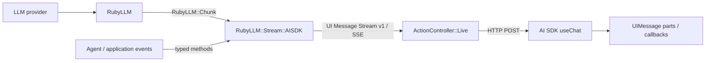

# RailsでLLM Streamingをちゃんと抽象化するまで

検証記事兼、発表用の解説下書き。コードはこのリポジトリで実行でき、掲載したレスポンスとブラウザ状態は 2026-09-04 に実際に採取した。

## 先に結論

Railsにはストリーミング機能がないわけではない。`ActionController::Live` が HTTP の transport を提供し、RubyLLM が provider ごとの断片を `RubyLLM::Chunk` に正規化している。足りなかったのは、その間とブラウザの間にある「LLMイベントの意味論」と「client state」の標準的な抽象だった。

今回作った `RubyLLM::Stream::AISDK` は、RubyLLM の chunk と agent event を AI SDK UI Message Stream Protocol v1 に直す純 Ruby の adapter だ。Rails は SSE frame を流し、React 側は `useChat` に parsing、蓄積、tool state、error、abort を任せる。

重要なのは、React を UI framework として全面採用したことではない。**`useChat` という LLM streaming runtime を借りた**、という選択である。通常の CRUD やページ遷移は Rails/Hotwire のまま、chat 部分だけを island にできる。

## できあがった境界



各層の責任は次のように分けた。

| 層 | 責任 | 持たせなかったもの |
| --- | --- | --- |
| RubyLLM | provider 差の吸収、chunk 化 | UI protocol、React state |
| `RubyLLM::Stream::AISDK` | event mapping、順序検証、SSE frame 化 | model 選択、会話保存、tool 実行、認可 |
| Rails | HTTP lifecycle、header、socket、切断処理 | event parser、client state |
| `useChat` | protocol parser、parts 蓄積、tool/error/abort state | Rails domain logic |

この境界にすると、LLM streaming は controller に散らばる特殊処理ではなく、交換可能な adapter になる。

## ここに至るまでの歴史

### 1. RubyLLMでprovider差は消えた

最初に解決したかったのは OpenAI、Anthropic、Gemini などの stream API 差だった。RubyLLM はそれを `RubyLLM::Chunk` にそろえてくれる。Rails 側は次のように書ける。

```ruby
chat.ask(prompt) do |chunk|
  # chunk.content / chunk.thinking / chunk.tool_calls
end
```

しかし、ここで抽象化は半分しか終わっていない。browser まで届けるには、次の責務が残る。

- HTTP stream format を決める
- UTF-8 の分割境界を安全に decode する
- text / reasoning / tool call を識別する
- delta を message state に足す
- retry や multi-step の境界を扱う
- error、abort、finish をそろえる

### 2. 自前fetchは動くが、protocolがapplication codeになる

初期形は典型的だった。

```text
RubyLLM::Chunk
  → 独自 JSON
  → SSE
  → response.stream
  → fetch
  → ReadableStream
  → TextDecoder
  → 独自 parser
  → accumulator
  → React state
```

text delta だけなら小さく見える。ところが reasoning、並列 tool call、partial JSON、approval、tool result、retry、abort が入るたびに、server と browser の両方へ状態機械が増える。ここを application ごとに持つのは保守対象を二重化する。

### 3. Turbo Streams over SSEはDOM更新には強い

Turbo Streams は server が DOM operation を送る用途にはよく合う。一方、今回必要なのは DOM 命令ではなく、LLM message の意味を持つ event log だった。

- `EventSource` は基本的に GET。chat submit は POST body を送りたい
- reasoning や tool approval は単なる `append` ではない
- retry で現在 step を捨てる、tool input を delta から構築する、といった state transition がある
- abort / resume / error の意味を client runtime と共有したい

Turbo が悪いのではなく、抽象化の軸が違う。

### 4. Hotwire版useChatを自作すると、またprotocol実装になる

Stimulus controller で parser と reducer を作れば UI は実現できる。ただし、それは事実上 `useChat` の一部を自作することになる。小さな UI のために transport parser、message accumulator、tool state、abort、error recovery まで所有するのは割に合わなかった。

### 5. AG-UIは有力だが、今回の最短距離ではない

[AG-UI](https://docs.ag-ui.com/) は agent と UI の vendor-neutral な event protocol として筋がよく、将来 adapter を追加する候補になる。ただ、今回の受け手は `useChat` と決まっている。AI SDK の transport がそのまま理解する protocol を出す方が、client code を最小化できる。

### 6. AI SDK UI Message Stream Protocolをwire contractにした

[公式仕様](https://ai-sdk.dev/docs/ai-sdk-ui/stream-protocol)は SSE の各 `data:` 行に typed JSON part を載せ、最後を `[DONE]` で閉じる。`useChat` は [`DefaultChatTransport`](https://ai-sdk.dev/docs/ai-sdk-ui/transport) を通してこれを読む。

最終形はこうなった。

```text
RubyLLM
  → RubyLLM::Stream::AISDK
  → AI SDK UI Message Stream Protocol
  → useChat
```

## adapterの設計

### common pathはchunkを渡すだけ

```ruby
stream = RubyLLM::Stream::AISDK.new(response.stream)

chat.ask(prompt) do |chunk|
  stream << chunk
end

stream.finish(finish_reason: :stop)
```

`write` / `<<` は `RubyLLM::Chunk` の次の値を自動変換する。

| RubyLLM | AI SDK event |
| --- | --- |
| `chunk.content` | `text-start` / `text-delta` / `text-end` |
| `chunk.thinking.text` | `reasoning-start` / `reasoning-delta` / `reasoning-end` |
| `thinking.signature` | reasoning `providerMetadata` |
| streamed `tool_calls` | `tool-input-start` / `tool-input-delta` / `tool-input-available` |
| invalid streamed tool JSON | `tool-input-error` |
| tool-result `RubyLLM::Message` | `tool-output-available` |

`start` と `start-step` は最初の書き込みで遅延生成する。`finish` は開いている text/reasoning/tool input を順番に閉じ、`finish-step`、`finish`、`[DONE]` まで出す。そのため simple case で protocol bookkeeping が controller へ漏れない。

RubyLLM 1.16 の `Content#text` は本文として、URL attachment は `file` event として扱う。local path や IO attachment は browser へ安全に公開できる URL へ変換できないため推測せず `ProtocolError` にする。同じ non-empty tool id/name が fragment ごとに再掲される provider は continuation として受理し、id に対して name が変わる曖昧な列は拒否する。

### すべてを自動推測しない

RubyLLM 1.16 の `Chunk` には、現時点で citations、files、approval、finish reason、tool result がない。存在しない情報を推測せず、agent/application が知っているイベントは typed method で明示する。

```ruby
stream.source_url(
  source_id: "source-ruby-llm",
  url: "https://rubyllm.com/",
  title: "RubyLLM"
)

stream.data(name: "progress", id: "job-1", data: { value: 50 })

stream.tool_approval_request(
  approval_id: "approval-weather",
  tool_call_id: "call-weather",
  reason: "External access"
)
stream.tool_approval_response(
  approval_id: "approval-weather",
  approved: true
)
stream.tool_output_available(
  tool_call_id: "call-weather",
  output: { celsius: 27 }
)
```

この API は protocol の全 surface を隠す facade ではない。頻出する RubyLLM chunk は自動変換し、それ以外は名前付き typed event として露出する「薄いが状態を理解する adapter」である。

### event順序を状態機械で守る

単なる `JSON.generate` helper にはしなかった。たとえば以下を実行時に拒否する。

- `text-start` 前の `text-delta`
- 未登録 tool への output
- approval response 前の tool output
- deny 済み tool への通常 output
- 二重 finish、`[DONE]` 後の書き込み
- NaN、任意 object、非 object の provider metadata

誤った stream は browser で離れた場所に症状が出る。server で早く失敗させた方が原因を特定しやすい。

### IO sinkとbuffered Enumerableを分けた

Rails Live では frame を即座に `response.stream.write` する。一方、IO を渡さなければ frame を配列に保持し、`Enumerable` な Rack body や unit test として使える。

```ruby
stream = RubyLLM::Stream::AISDK.new(message_id: "assistant-1")
stream << RubyLLM::Chunk.new(role: :assistant, content: "Hello")
stream.finish

[200, stream.headers, stream]
```

IO mode は memory を二重消費しないよう frame を保存しない。

### tachyurgy/ai_streamとの関係

[`tachyurgy/ai_stream`](https://github.com/tachyurgy/ai_stream) は pure Ruby で AI SDK 向け stream を組み立てる先行例として参考にした。ただし依存はしていない。

今回の実装は RubyLLM の `Chunk` / `Message` を直接受け、現在の UI Message Stream v1 の reasoning、approval、tool error/denied、source/file/data/custom/lifecycle まで扱い、event 間の順序も検証する。用途と責務を RubyLLM adapter に絞った。

## Rails側の実コード

最小 Rails 8.1 server の中心はこれだけである。

```ruby
class ChatsController < ApplicationController
  include ActionController::Live

  skip_forgery_protection

  def create
    stream = nil
    sequence = 0
    stream = RubyLLM::Stream::AISDK.new(
      response.stream,
      message_id: assistant_message_id,
      id_generator: -> { "demo-part-#{sequence += 1}" }
    )
    stream.headers.each { |name, value| response.headers[name] = value }

    DemoConversation.new(stream).run(
      scenario: params.fetch(:scenario, "complete")
    )
  rescue ActionController::Live::ClientDisconnected, IOError
    Rails.logger.info("AI SDK client disconnected")
  rescue StandardError => error
    Rails.logger.error(error.full_message)
    terminate_failed_stream(stream)
  ensure
    response.stream.close
  end

  private

  def terminate_failed_stream(stream)
    stream&.error(error_text: "Agent stream failed") unless stream&.finished?
  rescue ActionController::Live::ClientDisconnected, IOError
    Rails.logger.info("AI SDK client disconnected while reporting an error")
  end
end
```

[Rails公式ドキュメント](https://api.rubyonrails.org/classes/ActionController/Live.html)どおり、header は最初の write より前に設定し、`ensure` で stream を閉じる。browser の `stop()` は socket disconnect として届くので正常系として扱う。

provider・tool・serialization の予期しない例外は別系統で log に残し、まだ書き込める場合は generic な `error` と `[DONE]` で protocol を閉じる。例外詳細を browser へそのまま公開しない。

デモでは AI API を呼ばない。`DemoConversation` が固定 RubyLLM chunk と typed event を作る。これにより provider の速度、課金、availability に左右されず protocol 全体を regression test できる。

## React側の実コード

```tsx
const transport = useMemo(
  () => new DefaultChatTransport({ api: "/chat" }),
  [],
);

const {
  messages,
  status,
  error,
  sendMessage,
  stop,
  clearError,
} = useChat({
  transport,
  onData: (part) => record(`data:${part.type}`),
  onToolCall: ({ toolCall }) => record(`tool:${toolCall.toolName}`),
  onFinish: ({ isAbort, isError, finishReason }) =>
    record(`finish:${finishReason}:abort=${isAbort}:error=${isError}`),
});
```

`fetch`、`ReadableStream`、`TextDecoder`、SSE parser、delta accumulator はない。UI は `messages[].parts` を描画するだけで、text、reasoning、static tool、dynamic tool、source、file、data が protocol に従って蓄積される。

## 実装したevent coverage

| family | events |
| --- | --- |
| lifecycle | `start`, `start-step`, `finish-step`, `reset-step`, `finish`, `abort`, `error`, `message-metadata` |
| text | `text-start`, `text-delta`, `text-end` |
| reasoning | `reasoning-start`, `reasoning-delta`, `reasoning-end`, `reasoning-file` |
| tool input | `tool-input-start`, `tool-input-delta`, `tool-input-available`, `tool-input-error` |
| approval | `tool-approval-request`, `tool-approval-response` |
| tool output | `tool-output-available`, `tool-output-error`, `tool-output-denied` |
| sources/files | `source-url`, `source-document`, `file` |
| application | `data-*`（id replacement / transientを含む）, `custom` |
| terminator | `data: [DONE]` |

## 実測1: Railsの生レスポンス

実行コマンド:

```bash
curl -sS -D headers.txt -o stream.txt \
  -X POST \
  -H 'Content-Type: application/json' \
  --data '{"scenario":"complete"}' \
  http://127.0.0.1:3000/chat
```

実際の response header:

```http
HTTP/1.1 200 OK
content-type: text/event-stream
cache-control: no-cache
connection: keep-alive
x-vercel-ai-ui-message-stream: v1
x-accel-buffering: no
transfer-encoding: chunked
```

実際の response 抜粋:

```text
data: {"type":"start","messageId":"rails-demo-assistant","messageMetadata":{"traceId":"rails-fixed-001","phase":"started"}}

data: {"type":"reasoning-delta","id":"reasoning-demo-part-1","delta":"Check the request and available tools. "}

data: {"type":"text-delta","id":"text-demo-part-2","delta":"The RubyLLM chunks are now streaming."}

data: {"type":"tool-input-delta","toolCallId":"call-weather","inputTextDelta":"Tokyo\",\"units\":\"celsius\"}"}

data: {"type":"tool-input-available","toolCallId":"call-weather","toolName":"lookup_weather","input":{"city":"Tokyo","units":"celsius"}}

data: {"type":"tool-approval-request","approvalId":"approval-weather","toolCallId":"call-weather","reason":"This fixture demonstrates approval state."}

data: {"type":"tool-output-available","toolCallId":"call-weather","output":{"city":"Tokyo","celsius":27,"condition":"sunny"}}

data: {"type":"data-progress","data":{"value":100,"label":"done"},"id":"job-1"}

data: {"type":"finish","finishReason":"stop","messageMetadata":{"elapsedMs":42}}

data: [DONE]
```

完全シナリオは **42 JSON frames + `[DONE]`** だった。種類別の実測値は次のとおり。

```json
{
  "start": 1,
  "start-step": 2,
  "text-start": 2,
  "text-delta": 3,
  "text-end": 2,
  "reset-step": 1,
  "reasoning-start": 1,
  "reasoning-delta": 2,
  "reasoning-end": 1,
  "tool-input-start": 1,
  "tool-input-delta": 2,
  "tool-input-available": 3,
  "tool-input-error": 1,
  "tool-approval-request": 2,
  "tool-approval-response": 2,
  "tool-output-available": 2,
  "tool-output-error": 1,
  "tool-output-denied": 1,
  "finish-step": 2,
  "reasoning-file": 1,
  "source-url": 1,
  "source-document": 1,
  "file": 1,
  "data-progress": 2,
  "data-notice": 1,
  "custom": 1,
  "message-metadata": 1,
  "finish": 1
}
```

## 実測2: useChatをCDPで検証

Chromium 152 を Chrome DevTools Protocol で操作し、`http://127.0.0.1:5173` のボタンを実際に押した。mock fetch だけのテストではない。

### complete

Network panel で `POST /chat` が 200、response の `content-type: text/event-stream` と `x-vercel-ai-ui-message-stream: v1`、body の `[DONE]` を確認した。

`useChat` が蓄積した assistant part は次の形になった。

```json
[
  { "type": "step-start" },
  { "type": "reasoning", "state": "done" },
  { "type": "text", "state": "done" },
  { "type": "tool-lookup_weather", "state": "output-available" },
  { "type": "step-start" },
  { "type": "reasoning-file" },
  { "type": "source-url" },
  { "type": "source-document" },
  { "type": "file" },
  { "type": "data-progress" },
  { "type": "custom" },
  { "type": "dynamic-tool", "state": "output-denied" },
  { "type": "dynamic-tool", "state": "output-error" },
  { "type": "dynamic-tool", "state": "output-error" }
]
```

`reset-step` より前に送った `This retry is intentionally removed.` は最終 state に残らなかった。`data-progress` は同じ id への2回の event が `{ value: 100 }` の1 part に置換され、`data-notice` は transient なので callback だけに現れた。

callback の実測:

```text
request:complete
tool:lookup_weather
data:data-progress
data:data-progress
data:data-notice
tool:delete_file
tool:unstable_service
finish:stop:abort=false:error=false
```

### error

server は partial text を閉じてから `error` と `[DONE]` を送った。browser の実測 state:

```json
{
  "status": "error",
  "alert": "Synthetic provider failure",
  "partialText": "A partial answer survives. ",
  "callbacks": [
    "error:Synthetic provider failure",
    "finish:none:abort=false:error=true"
  ]
}
```

partial response を失わず、hook は error として終了した。

### abort

protocol の server-originated `abort` も別シナリオで送った。AI SDK 7.0.92 / `@ai-sdk/react` 4.0.95 の実測では text を閉じて `ready` へ戻るが、`useChat` の `onFinish.isAbort` は `false` だった。installed source でもこの flag は hook が持つ `AbortController` の発火で立つ。server abort reason を UI に表示したい場合は、現行 client では `messageMetadata` または `data-*` を併送する必要がある。

実際の browser state:

```json
{
  "status": "ready",
  "text": "The server stopped this agent run. ",
  "metadata": { "traceId": "rails-abort-001" },
  "callbacks": [
    "request:abort",
    "finish:none:abort=false:error=false"
  ]
}
```

同じ request を Network panel で開くと、末尾は次のとおりだった。

```text
data: {"type":"finish-step"}

data: {"type":"abort","reason":"Synthetic agent abort"}

data: [DONE]
```

この差は protocol event を実装して mock shape を通すだけでは見つからず、実際の `useChat` reducer を走らせて初めて確認できた。

### client stop

slow stream の途中、6 token を受信した時点で UI の `Stop` を押した。

```json
{
  "beforeStatus": "streaming",
  "afterStatus": "ready",
  "lastText": "token-0 token-1 token-2 token-3 token-4 token-5 ",
  "callbacks": "finish:none:abort=true:error=false"
}
```

Rails log には `AI SDK client disconnected`、request time は約 1.2 秒と記録された。100 token 分の処理を最後まで待っていない。最終再検証時の browser console は Vite 接続と React DevTools の info だけで、application error/warning は 0 件だった。

## 実測3: automated tests

最終実行結果:

```text
core:   24 runs, 100 assertions, 0 failures, 0 errors, 0 skips
RBS:    rbs -I sig validate → success
RuboCop: 9 files inspected, no offenses detected
Rails:   6 runs, 53 assertions, 0 failures, 0 errors, 0 skips
React:   3 tests passed
Vite:    TypeScript check + production build succeeded
```

core test は event shape だけでなく、並列 tool key、partial JSON、approval 順序、denied/error、reset、IO sink、Rack enumeration、terminal event 後の write rejection を検査する。React test は実際の `useChat` に fixture SSE を読ませ、complete/error の hook state を検査する。

GitHub Actions は core を Ruby 3.2 / 3.3 / 3.4 / 4.0 で走らせ、Rails demo と React test/build を独立 job で検証する構成にした。公開時はこの remote matrix の実走成功も確認する。

## 別エージェントによる抽象化レビュー

実装担当とは別のサブエージェントに、API、抽象化の粒度、Rails の使い勝手、拡張性をコードと実行結果から評価させた。初回は API 8/10、抽象化 7/10、Rails UX 6/10、拡張性 6/10。「wire adapter という境界は正しいが、RubyLLM tool callback の実順序、例外終端、CI に公開阻害要因がある」という結論だった。

特に価値があったのは、README の tool-result recipe を実行して次を再現したことだ。

```text
RubyLLM::Stream::AISDK::ProtocolError:
tool invocation "call-1" has no available input
```

`write_message(tool_result)` が同一 step の未確定 tool input を先に flush するよう修正し、valid JSON、parallel tool、invalid JSON の三経路を回帰テストにした。request shape、provider 例外終端、CI 対象、support range も同じレビューから修正した。

修正後の再レビューでは、gemspec の `~> 1.16` が意図した 1.16.x ではなく 1.x 全体を許す最後の不一致も見つかった。`~> 1.16.0` へ狭めて gem を再 build し、最終判定は「ローカル公開 blocker なし」。公開時は GitHub 上の Ruby 3.2–4.0 matrix 実走成功を gate にする。

評価全文と対応表は [`docs/abstraction-review.md`](abstraction-review.md) に残してある。発表では成功例だけでなく、「別の利用者が README をコピーして壊れないか」を検証した過程として扱う。

## RubyLLM側を調べて分かった制約

RubyLLM の provider adapter は同じ `Chunk` interface を返すが、streamed tool call の情報量は provider によって違う。

- Anthropic 系は index / stream key を保てるため並列 fragment を相関しやすい
- Gemini / Vertex AI は structured arguments を完成形で返す場合がある
- OpenAI / Bedrock の一部 path は fragment に invocation id がなく「直近 tool」へ足すしかない場合がある

後者で同時に複数 tool が曖昧に流れると、下流 adapter だけでは完全な復元はできない。これは protocol writer の不足ではなく upstream information loss である。provider が識別子を出す場合は stream key を使い、曖昧な fragment は検出できる範囲で `ProtocolError` にする。

また tool result は通常の chunk block へ戻らない。agent loop では `after_message` から tool-result message を渡すか、RubyLLM instrumentation の tool-call event を使う必要がある。

```ruby
chat.after_message do |message|
  stream.write_message(message) if message.tool_result?
end
```

## 運用で気をつけること

1. `ActionController::Live` は request ごとに別 thread を使う。Puma thread 数と長時間 connection 数を見積もる。
2. reverse proxy の buffering を止める。adapter は `x-accel-buffering: no` を返すが、platform 固有設定も確認する。
3. header は最初の frame より前に設定する。
4. client abort は例外ではなく正常な cancellation path として観測する。
5. tool 実行・approval 認可・入力 validation は application の責任。wire event を受けたこと自体を権限として扱わない。
6. assistant message id は request ごとに一意にする。デモは最後の user message id を suffix に使う。
7. `messageMetadata` や tool payload に secret を載せない。browser へ送る JSON である。

## 実行方法

Terminal 1:

```bash
cd examples/rails_demo
bundle install
bin/rails server -b 127.0.0.1 -p 3000
```

Terminal 2:

```bash
cd examples/react_client
npm install
npm run dev
```

`http://127.0.0.1:5173` を開き、次を順番に押す。

1. **Run every event** — 全 event family と最終 state
2. **Run error path** — partial text を保った error
3. **Run server abort** — server-originated abort と `useChat` の実際の扱い
4. **Run slow stream** → **Stop** — browser abort と Rails disconnect

## 発表構成案（15〜20分）

1. 2分: 「Railsにstreamがない」は本当か
2. 3分: RubyLLM で provider 差を消しても残った browser 側の責務
3. 3分: 自前 fetch、Turbo、Hotwire clone、AG-UI をどう評価したか
4. 4分: `RubyLLM::Stream::AISDK` の境界と状態機械
5. 5分: Rails + React demo。reasoning → tool approval → output → error → abort
6. 2分: 制約と、canonical agent events / AG-UI adapter への将来拡張

デモで強調する一文:

> Railsを捨ててReactにしたのではない。RailsのHTTP transportとRubyLLMのprovider抽象を残し、足りなかったLLM event contractだけを標準化した。

## 次に進めるなら

- RubyLLM の instrumentation と adapter を結ぶ小さな integration helper
- application 内部の canonical agent event を定義し、AI SDK と AG-UI を sibling adapter にする
- Rails production server / proxy ごとの disconnect、buffering、backpressure 検証
- AI SDK package 更新時に TypeScript の upstream schema を fixture と照合する conformance test
- approval response を client から Rails へ戻す往路 API の reference implementation

## 参考資料

- [AI SDK: Stream Protocols](https://ai-sdk.dev/docs/ai-sdk-ui/stream-protocol)
- [AI SDK: useChat](https://ai-sdk.dev/docs/reference/ai-sdk-ui/use-chat)
- [AI SDK: Chatbot Transport](https://ai-sdk.dev/docs/ai-sdk-ui/transport)
- [AI SDK source: UI message chunks](https://github.com/vercel/ai/blob/main/packages/ai/src/ui-message-stream/ui-message-chunks.ts)
- [RubyLLM: Streaming Responses](https://rubyllm.com/next/streaming/)
- [Rails API: ActionController::Live](https://api.rubyonrails.org/classes/ActionController/Live.html)
- [AG-UI documentation](https://docs.ag-ui.com/)
- [tachyurgy/ai_stream](https://github.com/tachyurgy/ai_stream)
